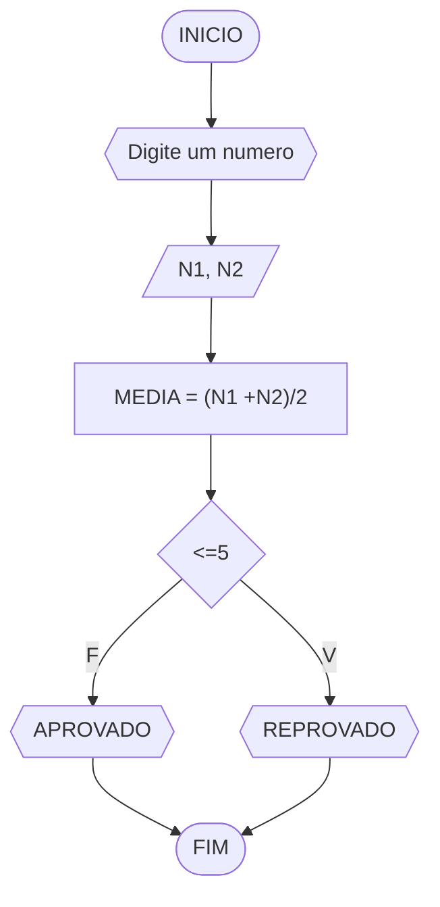
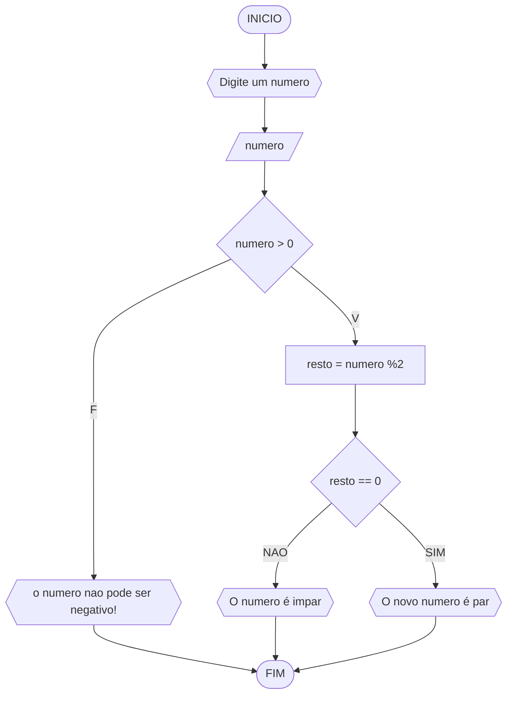

# UNIFOR
Disciplina: Raciocinio Logico algoritimico
Orientador: Prof. Ricardo Carubbi

## Lista 1 de exercicios

### Exercicio 01
Represente, em fluxograma e pseudocódigo, um algoritmo para calcular a média aritmética entre duas notas de um aluno e mostrar sua situação, que pode ser aprovado ou reprovado.
#### Fluxograma

```

ALGORITIMO verifica se foi aprovado ou reprovado
DECLARE N1,N2
ESCREVA "Digite um numero"
LEIA numero
DECLARE MEDIA
CALCULE MEDIA (N1 + N2)/2
LEIA MEDIA
SE MEDIA for <=5 ENTAO
		ESCREVA "REPROVADO"
SENAO
		ESCREVA"APROVADO"
FIM
```

### Exercicio 03
Represente, em fluxograma e pseudocódigo, um algoritmo para determinar se um número inteiro e positivo é par ou impar.
#### Fluxograma


```
ALGORITIMO verificar_par_impar
DECLARE numero, resto INTEIRO
ESCREVA "Digite um numero"
LEIA numero
SE numero > 0 ENTAO
      SE resto = 0 ENTAO
	    ESCREVA "O numero é par1"
	SENAO
		ESCREVA "O numero é impar!"
SENAO
	ESCREVA "O numero deve ser positivo!"
FIM
  ```
