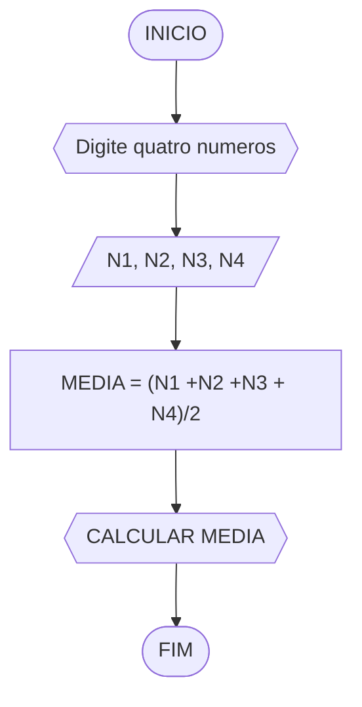

# UNIFOR
*Disciplina:* Raciocinio Logico algoritimico
*Orientador:* Prof. Ricardo Carubbi

## Lista 2 de exercicios

### Exercicio 01
Calcule a média de quatro números inteiros dados.
#### Fluxograma

```
ALGORITIMO “Cálculo da média de quatro valores”
DECLARE N1,N2,N3,N4
ESCREVA "Digite quatro numeros"
LEIA numero
DECLARE MEDIA
CALCULE MEDIA (N1 + N2 + N3 + N4)/2
LEIA MEDIA
FIM
```
