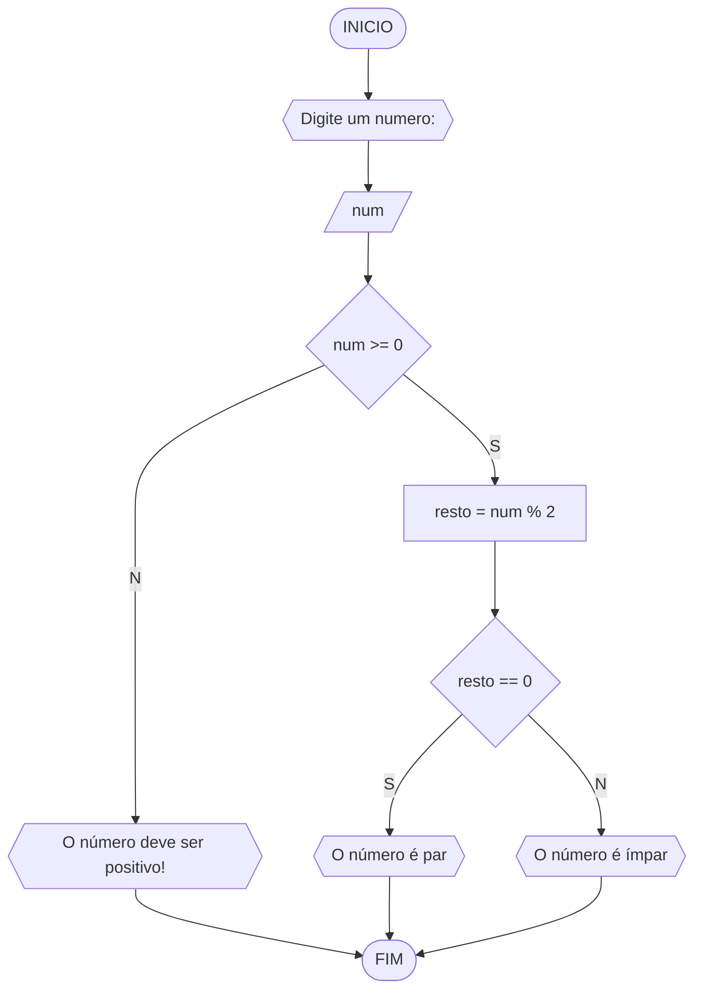
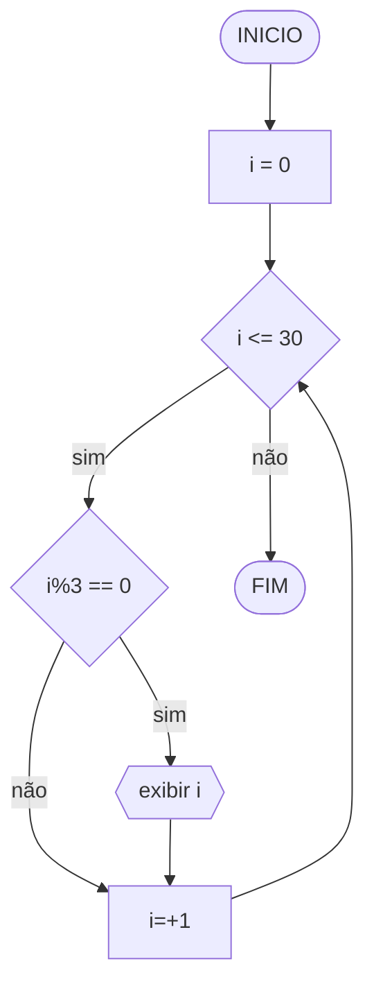
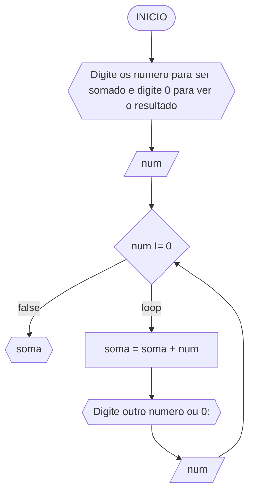
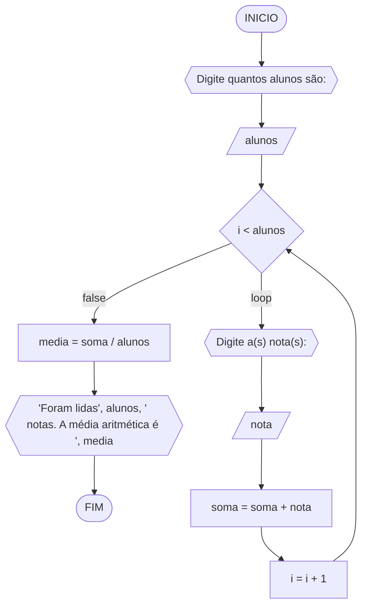

# UNIFOR
Disciplina: Raciocinio Logico algoritimico
Orientador: Prof. Ricardo Carubbi

## Lista 3 de exercicios

### Exercicio 02
Atualize o algoritmo para determinar se um número inteiro e positivo é par ou ímpar

#### Pseudocódigo
```
ALGORITMO verfica_par_impar
DECLARE num: int, resto
INICIO
ESCREVA "Digite um número: "
LEIA num
ENQUANTO num < 0 FAÇA
	ESCREVA “Digite um número positivo: "
	LEIA num
FIM_ENQUANTO
resto = num % 2
SE resto == 0 ENTÃO
	ESCREVA "O número é par"
SENÃO
	ESCREVA "O número é ímpar"
FIM 
 
```	
#### Teste de mesa 

| Entrada | Saída |
|      --      |      --      |
|      10      |  Numero Par  |
|      55      | Numero Impar |

### Exercicio 02
Faça um algoritmo que exiba na tela uma contagem de 0 até 30, exibindo apenas os múltiplos de 3.

#### Pseudocódigo 

```
Algoritmo ClassificaCategoria
DECLARAR num, i: int
INICIAR
num = 0
SE num < 31 ENTAO
	i = num % 3
	SE i == 0 ENTAO
		ESCREVER num
	i = i + 1
FIM
```

#### Teste de mesa 

| Saída |
|   -   | 
|0|
|3|
|6|
|9|
|12|
|15|
|18|
|21|
|24|
|27|
|30|

### Exercício 03 
Dada uma sequência de números inteiros, calcular a sua soma. 
Por exemplo, para a sequência {12, 17, 4, -6, 8, 0}, o seu programa deve escrever o número 35.

#### Fluxograma 



#### Pseudocódigo 

```
Algoritmo ClassificaCategoria
DECLARAR num, soma: INTEIRO
INICIAR
ESCREVA "Digite os numero para ser somado e digite 0 para ver o resultado"
LEIA num
ENQUANTO num != 0 FAÇA
	soma = soma + num
	ESCREVA "Digite outro numero ou 0:"
	LEIA num
FIM_ENQUANTO
ESCREVER soma
FIM
```

#### Teste de mesa 

| entrada1 | entrada2 | entrada3 | entrada4 | Saída | 
|      --      |      --      |      --      |      --      |      --      | 
| 15     | 5      | -13    |  0     | 7    |
| 11   | -3   | 14   | 0 | 22  |

### Exercício 04 (2.5 pontos)
Escreva um programa que leia a nota de diversos alunos, até que seja digitada uma nota negativa. 
Nesse momento, ele mostra a média aritmética de todas as notas lidas e quantas notas foram lidas. 
Ex. Foram lidas 14 notas. A média aritmética é 6.75!

#### Fluxograma 



#### Pseudocódigo 

```
Algoritmo ClassificaCategoria
DECLARAR alunos, nota, soma, media
INICIAR
ESCREVER "Digite quantos alunos são:"
LEIA alunos
SE i < alunos FAÇA
	ESCREVER "Digite a(s) nota(s):"
	LEIA nota
	soma = soma + notas
	i = i + 1
media = soma / alunos
ESCREVER "Foram lidas", alunos, " notas. A média aritmética é ", media
FIM
```

#### Teste de mesa 

| Entrada1 | Entrada2 | Entrada3 | Entrada4 | Saída | 
|      --      |      --      |      --      |      --      |      --      | 
| 3     | 7.5       | 8.5    | 8 | Foram lidas 3 notas. A média aritmética é 8.0|
| 2     | 10        | 7      | - |Foram lidas 2 notas. A média aritmética é 8.5|
